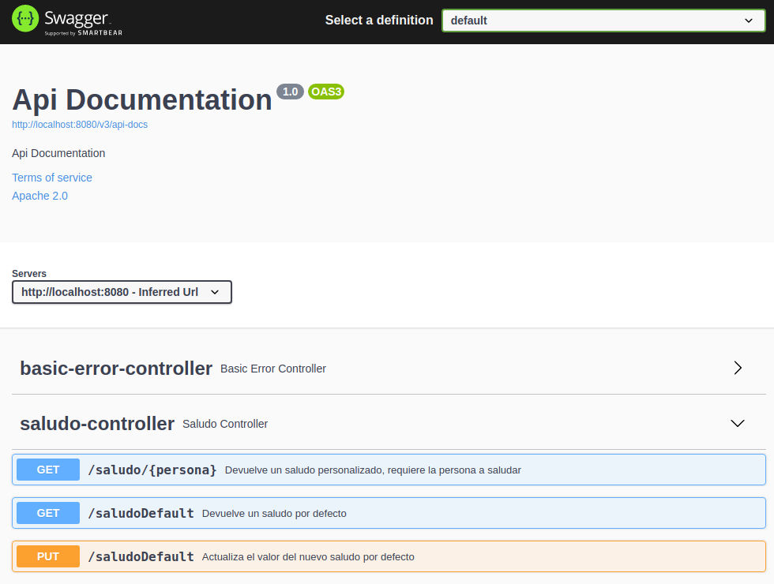
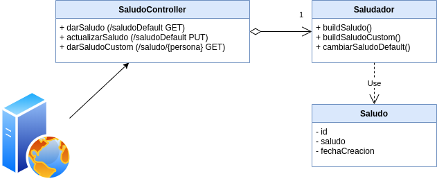

# Primer ejemplo Servicio REST: Saludo con Springboot

[](https://github.com/uqbar-project/saludo-springboot/actions/workflows/build.yml) 

## Qué es Spring Boot


Spring es un framework para desarrollar aplicaciones web que corre sobre una JDK Java. Tiene una amplia gama de configuraciones de lenguaje (Java, Groovy, Kotlin), de herramientas de manejo de dependencias (Maven, Gradle), de servidores Web (Jetty, Tomcat, Undertow) e incluso de formas de persistir la información. Es decir, es una tecnología que permite construir una aplicación comercial desde cero. Como esto puede resultar un poco agobiante, vamos a tomar la variante **Spring Boot**, que tomará algunas decisiones iniciales por nosotros, lo que va a suavizar la curva inicial de aprendizaje de esta tecnología.

## Ejecutando el proyecto

El proyecto tiene un main, en la clase `SaludadorApplication`:

```xtend
@SpringBootApplication class SaludadorApplication {
	def static void main(String[] args) {
		SpringApplication.run(SaludadorApplication, args)
	}
}
```

Cuando levantamos la aplicación, lo que hace Spring es levantar un servidor web que está escuchando pedidos por un socket, el puerto 8080.


Para profundizar más te recomendamos leer [el artículo introductorio a la Arquitectura Web](http://wiki.uqbar.org/wiki/articles/ui-web-intro-arquitectura.html).

## Requerimientos a resolver

Queremos poder

- recibir un saludo que por defecto sea "Hola mundo!"
- configurar ese saludo, poder cambiarlo
- hacer un saludo parametrizado a una determinada persona

## Controller / Endpoints / Rutas

Para resolver estos requerimientos vamos a implementar un **Controller**, la clase encargada de responder los pedidos que van a llegar por el protocolo http (en breve veremos cómo).

### Convention over configuration

Por defecto el controller se ubica en el package `org.uqbar.saludador.controller`, mientras que la clase que apunta a la aplicación principal es `org.uqbar.saludador`. Esto permite que no tengamos que agregar archivos de configuración específicos, **por convención** Spring buscará un paquete `controller` a partir de `org.uqbar.saludador`.

### Saludo default

El primer caso de uso es recibir un saludo que por defecto sea "Hola mundo!". Dado que es un pedido que solo pide información y no produce efecto colateral (no se modifica el estado del sistema), escribiremos un método http GET.

El controller tiene como responsabilidad

- adaptar la información de entrada, generando el grafo de objetos necesario
- delegar a dichos objetos la resolución del requerimiento
- y devolver la información correspondiente a través del protocolo http (en nuestro caso `json`)
- adicionalmente, tiene que ser capaz de rechazar pedidos inválidos, autenticar y manejar errores de programa

Es frecuente que el controller se termine transformando en un objeto con mucha responsabilidad, un **God Object**. En ese caso nos podemos preguntar si no faltan abstracciones que puedan tomar algunas de esas responsabilidades.

Veamos una posible solución:

```xtend
@RestController
class SaludoController {
	
  Saludador saludador = new Saludador()
	
  @GetMapping(value = "/saludoDefault")
  def darSaludo() {
    this.saludador.buildSaludo()
  }

}

class Saludador {
  @Accessors String saludoDefault = "Hola mundo!"
	
  def buildSaludo() {
    buildSaludoCustom(this.saludoDefault)
  }

	def buildSaludoCustom(String mensaje) {
		new Saludo(ultimoId++, mensaje)
	}

}

@Generated
@Data
class Saludo implements Serializable {
  int id
  String saludo
  LocalDateTime fechaCreacion = LocalDateTime.now
}
```


- el Saludador guarda como estado el saludo default
- el Saludo es un _value object_, que el Controller exporta como resultado convirtiéndolo por default en JSON (publica **todas sus variables de instancia**). Lo anotamos con `@Generated` para excluirlo de JaCoCo, [el proceso que mide la cobertura de los tests](https://www.baeldung.com/jacoco-report-exclude) (ya que es un objeto que tiene un comportamiento generado que no llegamos a ver y no tiene sentido generar tests sobre eso).

### Mapeo de Rutas

Si vieron la definición del método en el controller

```xtend
@GetMapping(value = "/saludoDefault")
def darSaludo() {
```

la annotation `GetMapping` permite asociarla con una **ruta** de nuestro web server, que se forma con

- nuestra IP (`localhost`)
- el puerto (que por defecto es 8080)
- y la ruta específica `"/saludoDefault"`, vía GET, que se asocia al método darSaludo

Esto permite que levantemos nuestro servidor Jetty con Springboot y desde un navegador probemos:

`http://localhost:8080/saludoDefault`

lo que devolverá algo similar a

```json
{
  "id": 1,
  "saludo":"Hola mundo!",
  "fechaCreacion":"2020-06-26T22:03:31.444752"
}
```

La respuesta se publica en el body del navegador gracias a que definimos que nuestro controller es REST mediante la anotación `@RestController`. Más adelante veremos diferentes técnicas para convertir a JSON nuestros objetos.

### Método PUT

Si queremos modificar el saludo por defecto, que está en la clase Saludador como `@Accessors String saludoDefault = "Hola mundo!"`, tenemos que crear un método nuevo en el controller:

- dado que estaremos invocando una acción que modifica el estado de mi sistema, podemos utilizar el método `PUT` o el `PATCH`. Pueden ver [la diferencia entre pisar todos los valores de mi estado (PUT) vs. modificar solo una parte del estado (PATCH) en este artículo](https://stackoverflow.com/questions/28459418/use-of-put-vs-patch-methods-in-rest-api-real-life-scenarios). Es importante **respetar el contrato que definen las especificaciones de http para facilitar a quien quiere utilizar nuestros servicios**.
- el método que escribiremos en el controller también se llama **endpoint**
- podemos pasarle parámetros en el header, pero vamos a preferir utilizar el body. En este caso sencillo vamos a pasar un string plano, en otros donde necesitemos pasar más información evitaremos el _long parameter method_ abstrayendo un objeto, que se escribirá como un JSON en nuestro cliente.

Veamos la definición del controller:

```xtend
@PutMapping(value = "/saludoDefault")
def actualizarSaludo(@RequestBody String nuevoSaludo) {
	this.saludador.saludoDefault = nuevoSaludo
	new ResponseEntity("Se actualizó el saludo correctamente", HttpStatus.OK)
}
```

El controller delega al setter implícito del Saludador, y luego devuelve

- un mensaje en el body
- y un código de HTTP, donde OK = 200


### ¿Dónde lo pruebo?

Para probar nuestro endpoint utilizaremos [POSTMAN](https://www.postman.com/downloads/) (otras variantes son [Insomnia](https://support.insomnia.rest/article/23-installation), [Advanced REST Client](https://chrome.google.com/webstore/detail/advanced-rest-client/hgmloofddffdnphfgcellkdfbfbjeloo?hl=es)), el cliente web de nuestra aplicación. Hay que seguir los siguientes pasos:

- configurar el endpoint
- definirle el método PUT
- ir a la solapa body y escribir un saludo default (lo que constituye nuestro _payload_)
- ejecutar el endpoint


En el video vemos cómo levantamos la aplicación, luego vamos a POSTMAN, creamos una collection que agrupa varios requests, y luego configuramos la llamada al endpoint. Por último, luego de ejecutar vemos la respuesta en el body y el status 200.

Si ahora hacemos el pedido vía GET, veremos que nuestro saludo default se modificó:


## Swagger

En la solución vamos a agregar la anotación `@ApiOperation` sobre los controllers, 

```xtend
@GetMapping(value = "/saludoDefault")
@ApiOperation("Devuelve un saludo por defecto")
def darSaludo() {
```

La dependencia **Swagger** permite construir una documentación online en base a estas anotaciones, e incluso provee una interfaz como alternativa para probar manualmente tus controllers:

```bash
http://localhost:8080/swagger-ui/index.html
```



Les recomendamos muy fuertemente que utilicen esta biblioteca como estrategia de documentación.


## Manejo de errores y códigos HTTP

Surge un agregado: no queremos que se pueda configurar "Dodain" como saludo default. Esta restricción, ¿dónde la ubicamos?

- en el controller
- en el Saludador
- en el constructor del objeto saludo

El objeto saludo es un value object, su objetivo es proveer un saludo inmutable. Es extraño tener una validación en el constructor, podríamos evitar esa llamada. Por otra parte, el controller tiene como objetivos adaptar los pedidos por http para que sean recibidos por el negocio que trabaja con el modelo de objetos. Si tenemos alguna otra forma de acceder a los objetos de negocio, tendremos que duplicar esa validación en algún otro lado. No parece ser responsabilidad del controller agregar este control que es propio del dominio.

Entonces modificamos un poco el negocio, para tener un método cambiarSaludo en Saludador, y hacemos que el controller llame a ese método:

```xtend
class SaludoController {
  @PutMapping(value = "/saludoDefault")
  def actualizarSaludo(@RequestBody String nuevoSaludo) {
    this.saludador.cambiarSaludoDefault(nuevoSaludo)
    new ResponseEntity("Se actualizó el saludo correctamente", HttpStatus.OK)
  }
}

class Saludador {
  static String DODAIN = "dodain"

  def cambiarSaludoDefault(String nuevoSaludo) {
    if (nuevoSaludo.equalsIgnoreCase(DODAIN)) {
      throw new BusinessException("No se puede saludar a " + DODAIN)
    }
    this.saludoDefault = nuevoSaludo
  }
```

¿Qué recibimos cuando queremos modificar nuestro saludo a "dodain"?

```json
{
    "timestamp": "2020-06-28T14:46:09.179+00:00",
    "status": 500,
    "error": "Internal Server Error",
    "trace": "...el stack trace...",
    "message": "No se puede saludar a dodain",
    "path": "/saludoDefault"
}
```

Bueno, el servidor Web de Java es inteligente y está haciendo un catch del error para que no se rompa. Pero el código de error que está devolviendo es **500** o _Internal Server Error_, es decir, [una excepción de programa, cuando en realidad se trata de un error de usuario](https://docs.google.com/document/d/1G0a9j-OA0rIEA5cdvEhIMbztJVo86ssvZKBK8HL9akg/edit#heading=h.3spsnsjiejzj).

El contrato de los errores de http es:

| Código de error | Qué indica |
| --- | --- |
| 20x (200, 201, 202...) | Todo anduvo ok |
| 40x (400, 401, 402...) | Error de usuario (400 - faltan parámetros, 401 - no estás autenticado, 403 - faltan permisos, 404 - no existe lo que quiero actualizar, etc.) |
| 50x (500, 501, 502...) | Error de programa (división por cero, referencia nula, etc.) |

Para más referencia pueden ver https://http.cat/, https://httpstatusdogs.com/, entre otros.

Agregamos una anotación en nuestra excepción custom para decirle a Springboot que cada vez que reciba esta excepción, devuelva un código de http 400:

```xtend
@ResponseStatus(BAD_REQUEST)
class BusinessException extends RuntimeException {
```

Ahora sí, cuando queremos saludar a Dodain, en lugar de un 500 recibimos un 400 (BAD_REQUEST), que permite a nuestro cliente entender más la causa del problema:

```json
{
    "timestamp": "2020-06-28T15:17:41.049+00:00",
    "status": 400,
    "error": "Bad Request",
    "trace": "... stack trace ...",
    "message": "No se puede saludar a dodain",
    "path": "/saludoDefault"
}
```

Una observación más: si hubiera otra causa posible de error (supongamos un problema de autenticación, o un recurso que no existe) deberíamos contemplar esos casos con valores de retorno adecuados: es conveniente discriminar los diferentes tipos de error para ayudar al usuario (sea una aplicación o una persona).

### Contrato general para métodos de una API REST

Cuando definamos un endpoint los métodos a utilizar según la [RFC-7231](https://tools.ietf.org/html/rfc7231#section-4) son:

| Método | Objetivo |
| --- | --- | 
| GET | Obtener información de un recurso |
| HEAD | Igual que GET, pero solo transmite status y header |
| POST | Generalmente asociado al alta de un recurso, también sirve para hacer el procesamiento de la información o _payload_ enviada |
| PUT | Reemplaza completamente el recurso en el servidor con el _payload_ que le pasamos en el pedido |
| PATCH | La información recibida en el _payload_ actualiza el recurso, el resto de la información en el servidor permanece igual |
| DELETE | Eliminamos todas las representaciones del recurso en el servidor |

Para más información pueden consultar [la especificación oficial para el protocolo http](https://tools.ietf.org/html/rfc7230) y [este artículo que discute la diferencia entre POST, PUT y PATCH](https://www.mscharhag.com/api-design/http-post-put-patch).

### Idempotencia

La especificación de http pide que los métodos GET, HEAD, PUT y DELETE sean [**idempotentes**](https://es.wikipedia.org/wiki/Idempotencia), es decir, que el request http se pueda realizar varias veces y aun así conseguir el mismo resultado que se obtendría si se realizase una sola vez. Es una buena práctica respetar este contrato:

- las operaciones GET, al no tener efecto colateral, garantizan esta propiedad
- las operaciones DELETE, la primera vez borran el recurso (y se obtiene un 200 - OK), luego tendremos un 404 (recurso no encontrado), lo cual está bien **porque el servidor mantiene el mismo estado que luego de invocar la primera operación DELETE**
- sucesivas operaciones PUT no deberían producir cambios: la primera vez se hace la modificación, y luego se pisa el mismo valor una y otra vez.
- la única operación que no puede garantizar la idempotencia es el método **POST**, porque cada vez que se invoca crea un nuevo recurso.

Para más información pueden investigar:

- [la especificación RFC-7231](https://tools.ietf.org/html/rfc7231#section-4.2.2)
- [el artículo de Mozilla](https://developer.mozilla.org/en-US/docs/Glossary/idempotent)

## Saludo custom

Para el saludo custom, vamos a hacer un pedido GET donde dentro de la URI queremos enviar a qué persona saludar. Springboot permite parametrizar el valor recibido y guardarlo en un String para usarlo posteriormente, como vamos a ver aquí:

```xtend
@GetMapping(value = "/saludo/{persona}")
def darSaludoCustom(@PathVariable String persona) {
  this.saludador.buildSaludoCustom("Hola " + persona + "!")
}
```

Esto se prueba en un navegador o POSTMAN:

```
http://localhost:8080/saludo/Julian
```

## Testeo unitario de endpoints

Para el testeo de endpoints, recomendamos [leer este artículo](https://thepracticaldeveloper.com/2020/06/04/guide-spring-boot-controller-tests/). Lo primero que debemos hacer es encontrar los escenarios para ejecutar los tests:

- cuando pedimos el saludo default, nos tiene que devolver "Hola mundo!"
- actualizar el saludo default tiene dos casos:
  - el inválido según reglas de negocio, tiene que fallar (pero el error debe ser de usuario, lo que equivale a un `400`)
  - el válido debe actualizar cuando le pidamos nuevamente el saludo default
- el saludo custom debe devolver el saludo específico según las reglas de negocio

Un dato interesante es que si primero se ejecuta el test que cambia el saludo default, eso no debe interferir en el primer test, que espera una respuesta en base a la configuración inicial.

Veamos entonces cómo configurar el grupo de tests

```xtend
@AutoConfigureJsonTesters
@ContextConfiguration(classes=SaludoController)
@WebMvcTest
@DisplayName("Dado un controller de saludo")
@DirtiesContext(classMode = ClassMode.BEFORE_EACH_TEST_METHOD)
class SaludoControllerTest {

	@Autowired
	MockMvc mockMvc
```

Las configuraciones importantes son:

- `@ContextConfiguration` indicando el o los controllers que estamos testeando
- `@AutoConfigureJsonTesters` permite habilitar la serialización a JSON de las respuestas de cada endpoint
- `@DirtiesContext` es necesario en este caso para probar la actualización del saludo default garantizando la independencia con el test que prueba el saludo inicial "Hola mundo!". De lo contrario podés tener _flaky tests_ dependiendo del orden en el que se evalúen.

Cada test levanta un servidor Spring en modo test, que es más liviano. Sobre él vamos a correr cada escenario:

```xtend
@DisplayName("el saludo default es el que tiene el saludador")
@Test
def void testObtenerSaludoDefault() {
  val responseEntity = mockMvc.perform(MockMvcRequestBuilders.get("/saludoDefault")). andReturn.response
  assertEquals(200, responseEntity.status)
  assertEquals(responseEntity.getField("saludo"), "Hola mundo!")
}
```

El primer test hace el llamado a la URI "/saludoDefault" vía get (por eso el método es `MockMvcRequestBuilders.get`), captura la respuesta y verificamos

- que el código de http es 200
- que el JSON tiene un atributo "saludo" con el valor "Hola mundo!" (para eso nos valemos de un _extension method_ getField, que pueden ver en el archivo, lo que hace es convertir la respuesta JSON que se ve como string, a un mapa de propiedades y luego obtiene el valor de la propiedad que estamos buscando)

Ahora veremos el test que prueba el caso inválido al actualizar el saludo por defecto

```xtend
@DisplayName("actualizar el saludo a un valor inválido produce un error de usuario")
@Test
def void testActualizarSaludoDefaultIncorrecto() {
  val responseEntity = mockMvc.perform(MockMvcRequestBuilders.put("/saludoDefault").content("dodain")).andReturn.response
  assertEquals(400, responseEntity.status)
}
```

Podríamos chequear el mensaje de error, esto acopla un poco más el test a la regla de negocio (cualquier cambio en el mensaje de error rompe el test). Como el método http es PUT, el método que usamos es `MockMvcRequestBuilders.put`

El tercer test tiene como parte interesante que estamos forzando el character set a UTF-8 para no tener problemas con las tildes (algo que Spring Boot decidió cambiar a partir de la versión 2.2.0). Luego lo que hace es bastante directo:

- actualiza el saludo default
- para luego hacer una llamada GET y verificar que en el body la actualización haya tomado efecto

```xtend
@DisplayName("actualizar el saludo a un valor válido actualiza correctamente")
@Test
def void testActualizarSaludoDefaultOk() {
	val nuevoSaludoDefault = "Hola San Martín!"
	mockMvc.perform(MockMvcRequestBuilders.put("/saludoDefault").content(nuevoSaludoDefault))
		.andExpect(status.isOk)
	mockMvc.perform(MockMvcRequestBuilders.get("/saludoDefault"))
		.andExpect(status.isOk)
		.andExpect(jsonPath("$.mensaje").value(nuevoSaludoDefault))
}
```

Pueden ver ustedes el resto de los tests.

## Resumen de la arquitectura


